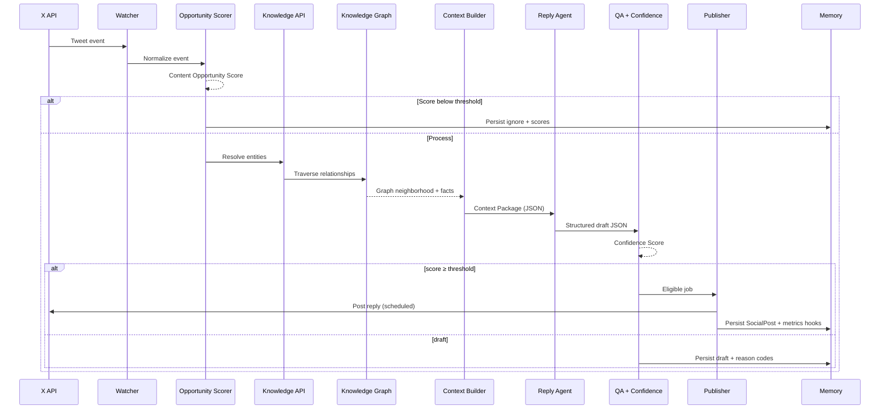
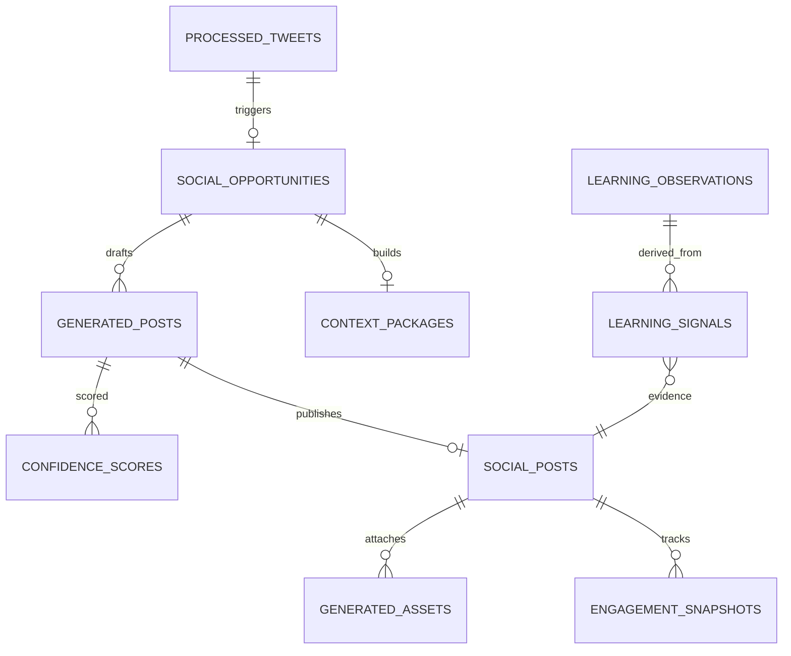

# ActorRating Intelligence Engine (ARIE)

**Technical Architecture RFC · v1.2 (FROZEN)**  
**Status:** Frozen — implementation may proceed; no new architectural features unless a sprint exposes a real need  
**Owner:** ActorRating Engineering  
**Last updated:** 2026-08-07  

---

## Document control

| Field | Value |
| --- | --- |
| Title | ActorRating Intelligence Engine (ARIE) — Technical Architecture |
| Version | 1.2 (frozen) |
| Classification | Internal engineering RFC |
| Scope | Real-time cinema intelligence engine; first output channel is X; later channels are adapters |
| Implementation state | **Greenfield** — this RFC defines target architecture; update sections as components ship |
| Related product systems | Actor / Movie / Performance **knowledge graph**, Radar craft scores, Rate pages, Performance editorial, Leaderboards, Admin dashboard |
| Litmus test | **Can this system run unattended for six months?** If not, fix the architecture before adding features. |
| Freeze rule | **No new architectural features** unless implementation exposes a real need. Prefer shipping. |
| Product name | **ARIE** (ActorRating Intelligence Engine) — not “Social AI” |

### How to use this document

1. This file is the **single source of truth** for **ARIE** (ActorRating Intelligence Engine).
2. **RFC is frozen at v1.2.** Do not add architecture for its own sake. Open an ADR only when a sprint hits a concrete blocker.
3. **RFC first, then implement** for any *approved* change. Every agent, endpoint, table, or workflow is specified here (or in an ADR) **before** writing n8n nodes or application code.
4. When you ship a component, update the matching section in the **same PR**. Mark subsections `Implemented` / `Partial` / `Planned`.
5. Do not invent alternate architectures in chat threads or Notion pages without folding decisions back here.
6. Open design questions live in [§19 Open questions](#19-open-questions--decisions-log). Resolved decisions move into the relevant body section.
7. Treat this as a **long-term engineering asset**. Publishing channels (X, Threads, newsletters, …) are **outputs**; the intelligence stays the same.

### Companion files (planned)

```
docs/arie/
  ARCHITECTURE.md          ← this RFC (SoT) — FROZEN v1.2
  BRAND_CONSTITUTION.md    ← permanent; every agent must reference
  prompts/                 ← versioned prompt contracts (per agent, semver)
  runbooks/                ← ops: incident, kill-switch, cost alarms
  adr/                     ← Architecture Decision Records (rare under freeze)
```

---

## Table of contents

1. [Vision](#1-vision)
2. [High-level system architecture](#2-high-level-system-architecture)
3. [Core principles](#3-core-principles)
4. [AI agent specifications](#4-ai-agent-specifications)
5. [Knowledge Graph Layer](#5-knowledge-graph-layer)
6. [Context Builder](#6-context-builder)
7. [ActorRating Knowledge API](#7-actorrating-knowledge-api)
8. [Memory system](#8-memory-system)
9. [Learning engine](#9-learning-engine)
10. [Dynamic asset engine](#10-dynamic-asset-engine)
11. [Content strategy](#11-content-strategy)
12. [Publishing rules](#12-publishing-rules)
13. [Database schema](#13-database-schema)
14. [n8n workflow architecture](#14-n8n-workflow-architecture)
15. [Deployment roadmap](#15-deployment-roadmap)
16. [Monitoring](#16-monitoring)
17. [Confidence Score](#17-confidence-score)
18. [Operational guidelines](#18-operational-guidelines)
19. [Open questions & decisions log](#19-open-questions--decisions-log)
20. [Appendix](#20-appendix)

**Binding companions**

- [Brand Constitution](./BRAND_CONSTITUTION.md) — permanent; every agent references it  
- Cost Governor — [§12.6](#126-cost-governor)  
- Experiment Framework — [§16.6](#166-experiment-framework)  

---

## 1. Vision

### 1.1 Mission

Build a **real-time cinema intelligence engine** — not a reply bot — that **extracts** value from ActorRating’s database and presents craft-first insight at the right moment, on whatever channel we wire next.

The AI does not create the value. ActorRating’s structured data does. ARIE’s job is timing, grounding, and voice.

This is infrastructure for distribution. No one-off n8n shortcuts. **Architecture is frozen; build the sprints.**

ActorRating rates **acting craft**, not movie quality. Social AI must reinforce that distinction in every public word.

### 1.2 Why we are building this

| Problem today | Cost | How Social AI helps |
| --- | --- | --- |
| Great rate-page / radar content is mostly pull (SEO, word of mouth) | Growth slow outside organic search | Push craft insights into live discourse where actors and films are already trending |
| Manual social is high quality but not scalable | Founder time, inconsistent cadence | System drafts / posts within strict brand + data guardrails |
| Generic “AI marketing bots” damage trust | Brand risk | Knowledge Graph + Knowledge API + Confidence Score + human thresholds |
| Trends move faster than research | Missed moments | Event → Opportunity Score → graph traversal → agents, measured in minutes |
| Unmeasurable posting | Cannot optimize | Funnel metrics in admin (opportunities → publish → CTR → waitlist/ratings) |

### 1.3 Guiding principles (summary)

Full list in [§3](#3-core-principles). The north star is:

> **Every automated post should feel like something a sharp film-literate human at ActorRating would publish after checking the numbers.**

### 1.4 Unattended readiness (architecture gate)

Before writing production n8n nodes that post publicly, the design must answer **yes** to:

| Question | Required answer |
| --- | --- |
| Can kill switches stop all publishing instantly? | Yes |
| Do all LLM steps emit versioned structured JSON? | Yes |
| Are facts traversable from the Knowledge Graph (not open-web scrape)? | Yes |
| Is every event scored and most ignored cheaply? | Yes |
| Can we roll back a prompt version without guessing? | Yes |
| Do drafts catch everything below Confidence threshold? | Yes |
| Is the Learning Engine forbidden from rewriting prompts? | Yes |
| Can we observe the full funnel in admin for 6 months of logs? | Yes |

If any answer is no, **fix the RFC first**.

### 1.5 Success metrics

**North-star**

- Sustained growth in **qualified visits** to ActorRating from social (rate pages, actor/movie hubs, craft leaderboards), attributed and non-spammy.

**Product / brand**

| Metric | Target direction | Notes |
| --- | --- | --- |
| Brand-safe incident rate | → 0 | Fabrication, wrong entity, offensive reply |
| Share of posts with Confidence ≥ auto-publish threshold | Stable or ↑ | Threshold starts conservative (see §17) |
| Click-through to AR from posts that include links | ↑ | Not every post needs a link |
| Reply helpfulness (human sample audit) | ≥ 80% “adds value” | Weekly sample |
| Duplicate / near-duplicate publish rate | → 0 | Memory system |

**Engagement (secondary, never primary)**

- Impressions, reply rate, quote rate, follower growth — tracked for learning, **not** optimized blindly.

**System**

| Metric | Initial SLO |
| --- | --- |
| Event → decision latency (p95) | &lt; 5 minutes for high-priority accounts |
| Knowledge API p95 | &lt; 400 ms cached / &lt; 2 s cold |
| Auto-publish error rate | &lt; 1% of eligible posts |
| Human review queue backlog | &lt; 50 drafts older than 24h |

### 1.6 Non-goals

Social AI **must never**:

1. Impersonate ActorRating users or invent community quotes.
2. Fabricate scores, rankings, cast lists, release dates, or quotes not present in ActorRating (or a vetted citation path).
3. Post political activism, culture-war bait, harassment, or pile-ons.
4. Optimize purely for engagement / virality at the expense of brand voice.
5. Self-modify production prompts without a human-reviewed change process ([§9](#9-learning-engine)).
6. Mass-reply, spam hashtags, or follow/unfollow growth hacks.
7. Claim ActorRating is an “AI rating engine” for performances we do not support with data.
8. Auto-post below Confidence threshold without explicit human approval.
9. Leak private user data, emails, or non-public ratings.
10. Become a general-purpose movie chatbot unanchored from craft and ActorRating.
11. Let the Learning Engine directly rewrite prompts or chase low-quality engagement tactics.

### 1.7 Product thesis

We win by being the account that **brings receipts** (Radar craft dimensions, community consensus, comparisons, leaderboards) into conversations that already care about acting — then invites discussion, not sermons.

Channels are adapters: X, Threads, Bluesky, SEO articles, newsletters, YouTube scripts, podcast notes, push, in-app recommendations. **The intelligence stays the same.**

---

## 2. High-level system architecture

### 2.1 System diagram

```text
                         X API
                           │
                           ▼
                  Event Collection Layer
                           │
                           ▼
              Content Opportunity Scorer
                           │
                 ┌─────────┴─────────┐
                 │                   │
           Ignore Tweet        Process Tweet
                                     │
                                     ▼
                      ActorRating Knowledge API
                                     │
                                     ▼
                         Knowledge Graph
                      (traverse, don't search)
                                     │
                                     ▼
                           Context Builder
                                     │
                                     ▼
                      Multi-Agent AI Pipeline
                     (structured JSON only)
                                     │
       ┌──────────────┬──────────────┬──────────────┐
       ▼              ▼              ▼              ▼
  Reply Agent   Quote Agent   Thread Agent   Original Post Agent
       │              │              │              │
       └──────────────┴──────────────┴──────────────┘
                              ▼
                  Quality Assurance Agent
                              ▼
                    Confidence Scorer
                              ▼
              ┌───────────────┴───────────────┐
              ▼                               ▼
     Auto-publish eligible              Draft / review queue
              ▼                               ▼
      Publishing Scheduler              (human or discard)
              ▼
              X
              ▼
    Engagement Collection Engine
              ▼
        Learning & Analytics
              ▼
         Admin Social Funnel
```

### 2.2 Component overview

| Layer | Responsibility | Primary tech (target) |
| --- | --- | --- |
| Event Collection | Ingest mentions, tracked accounts, keyword/trend streams | X API + n8n Watcher |
| Opportunity Scorer | Score every event; ignore most; pick format for the rest | Rules + light model (Groq) |
| Knowledge API | Deterministic ActorRating facts for social | Next.js route handlers / internal API |
| Knowledge Graph | Relationship traversal (actor↔movie↔performance↔radar) | Postgres graph queries over AR schema |
| Context Builder | Assemble structured context packages from traversals | Service module + cache |
| Agents | Draft copy / structure per format | Groq/LLM with **semver’d** prompts |
| QA + Confidence | Brand, facts, uniqueness, entity match | LLM critic + deterministic checks |
| Scheduler / Publisher | Human-like cadence, limits, kill-switch | n8n + Postgres |
| Assets | Charts, cards, comps from DB | Image render pipeline |
| Memory + Learning | Performance store + human-curated observations | Postgres |
| Admin funnel | Observable metrics for unattended ops | Existing `/admin` dashboard extension |

### 2.3 End-to-end sequence (reply path)



### 2.4 Trust boundary

```text
┌─────────────────────────────────────────────────────────┐
│ Untrusted: X content, trends, LLM free-text              │
└───────────────────────────┬─────────────────────────────┘
                            │ never published as fact
                            ▼
┌─────────────────────────────────────────────────────────┐
│ Trusted: ActorRating Postgres + Knowledge API outputs     │
│ Scores, cast, radar, leaderboards, editorial (published)  │
└───────────────────────────┬─────────────────────────────┘
                            │ only this may be stated as AR truth
                            ▼
┌─────────────────────────────────────────────────────────┐
│ Generated social copy (gated by QA + Confidence)         │
└─────────────────────────────────────────────────────────┘
```

---

## 3. Core principles

1. **Quality &gt; quantity** — Fewer excellent posts beat a firehose.
2. **Never sound automated** — No corporate filler, no “As an AI…”, no emoji spam, no hashtag walls.
3. **Always add value** — Insight, comparison, craft dimension, or a sharper question.
4. **Never fabricate facts** — If Knowledge API cannot support it, do not assert it.
5. **Use ActorRating data whenever possible** — Radar, community score, cohort rankings, comps.
6. **Promote discussion rather than advertise** — Soft CTAs; links earned, not forced.
7. **Every post should strengthen the brand** — Craft-first, respectful, specific.
8. **Structured knowledge over open-web search** — Traverse the Knowledge Graph; agents consume Context Packages, not random browsing.
9. **Human-in-the-loop where risk is high** — Low confidence → draft, never silent auto-post.
10. **Learn from outcomes without mutating prompts in the wild** — Observations become *recommendations*; humans ship prompt version bumps.
11. **Idempotent & restartable pipelines** — n8n workflows and jobs must tolerate retries.
12. **Measurable everything** — Opportunity Score, Confidence, funnel metrics, prompt versions — no black boxes.
13. **Score before you spend** — Most events are ignored after Opportunity Score; generation is expensive.
14. **Infrastructure, not scripts** — If it cannot run unattended for six months, it is not done.
15. **Constitution over prompts** — Brand Constitution is permanent; prompts are versioned experiments under it.
16. **Cost Governor** — Monthly budget with rising Opportunity thresholds; never silent unlimited spend.
17. **Experiments, not vibes** — Controlled A/B with sample sizes; rollbacks by version.

---

## 4. AI agent specifications

Conventions for every agent:

| Field | Meaning |
| --- | --- |
| Purpose | Why it exists |
| Inputs | Typed contract |
| Outputs | Typed **JSON** contract (never plain prose as the transport) |
| Prompt | Reference to `docs/social-ai/prompts/<agent>/vX.Y.md` |
| Temperature | Default sampling |
| Tools | Allowed tool/API calls |
| Failure modes | Expected errors |
| Retry logic | When / how many |
| Confidence contribution | Which Confidence sub-scores it influences |

### 4.0 Structured output contract (mandatory)

Every AI response that feeds a workflow must be **JSON**, parseable without regex scraping.

Example (Reply Agent):

```json
{
  "action": "reply",
  "confidence": 94,
  "reason": "Major casting announcement with strong ActorRating context",
  "prompt_version": "reply-writer@1.0",
  "entities": {
    "actors": ["Leonardo DiCaprio"],
    "director": "Christopher Nolan",
    "movies": ["Inception"]
  },
  "entity_ids": {
    "actors": ["nm0000138"],
    "movies": ["tt1375666"],
    "director_name": "Christopher Nolan"
  },
  "claims": [
    { "span": "Screen Presence", "fact_id": "radar:dim:…:screenPresence" }
  ],
  "reply": "…",
  "link_suggestion": null,
  "asset_request": null
}
```

Hard rules:

- Downstream nodes read fields, not paragraphs.
- Parse failure → retry once with repair prompt → else `status=failed` + alert.
- `action` is always one of: `ignore` | `reply` | `quote` | `thread` | `original` | `poll` | `draft_only`.
- Natural-language `reply` / `tweets` are fields *inside* the JSON, never the sole output.

### 4.0.1 Prompt versioning

Do **not** maintain a blob called “the reply prompt.”

```text
docs/social-ai/prompts/reply-writer/v1.0.md
docs/social-ai/prompts/reply-writer/v1.1.md   ← more questions, less promo, more comps
```

| Rule | Detail |
| --- | --- |
| Semver | `MAJOR.MINOR` in filename + front-matter |
| Pinning | Runtime config selects active version per agent |
| Rollback | Point config at previous file; no archaeology in n8n UI |
| Changelog | Each version file starts with “What changed / why” |
| Eval | Optional golden-set notes before promoting a version |

If engagement drops after a bump, roll back to the prior version and file an observation — do not guess in production.

Global LLM policy:

- **JSON-mode / schema outputs** required for classifiers, writers, QA, learning proposals.
- Log `prompt_version`, `model`, `input_hash`, `latency_ms`, `token_usage` on every call.
- No agent may call X publish APIs directly — only Publisher may.
- Default inference provider target: **Groq** (swappable behind an interface).

---

### 4.1 Trend Scout / Opportunity Classifier

| | |
| --- | --- |
| **Purpose** | Decide what to do with an inbound event (or whether to ignore). Emit a content opportunity, not final copy. |
| **Inputs** | Normalized tweet/event; account priority; recent AR social memory summaries; optional trend metadata |
| **Outputs** | `{ decision: ignore\|reply\|quote\|thread\|original_seed\|poll, reason_codes[], brand_relevance_0_100, trending_score_0_100, entity_hints[] }` |
| **Prompt** | `prompts/opportunity-classifier@v1.md` |
| **Temperature** | 0.2 |
| **Tools** | Optional: Knowledge API entity suggest (cheap) |
| **Failure modes** | Over-triggering on noise; missing priority accounts; false entity hints |
| **Retry logic** | 1× on parse failure; else ignore + log |
| **Confidence** | Feeds `relevance` prior |

**Ignore rules (deterministic, before LLM when possible):**

- Retweets of our own content with no commentary  
- Pure spam / crypto / adult / hate  
- Already processed `tweet_id`  
- Author muted / blocklist  
- Outside language policy (v1: English primary)

---

### 4.2 Research Agent

| | |
| --- | --- |
| **Purpose** | Resolve entity hints into ActorRating IDs and decide which Knowledge endpoints to call. Does **not** invent facts. |
| **Inputs** | Entity hints; tweet text; opportunity type |
| **Outputs** | `{ actors[], movies[], performances[], unresolved[], query_plan[] }` |
| **Prompt** | `prompts/research-agent@v1.md` |
| **Temperature** | 0.0–0.1 |
| **Tools** | `GET /social/resolve`, search endpoints only |
| **Failure modes** | Wrong Leonardo (ambiguous names); movie year collisions |
| **Retry logic** | 1× with disambiguation prompt if multiple candidates above threshold |
| **Confidence** | Dominant input to `entity_match` |

If unresolved and no high-confidence entity → opportunity degrades to ignore or human draft with explanation.

---

### 4.3 Context Builder (service, not chatty LLM)

See [§5](#6-context-builder). Prefer **deterministic assembly**. Optional tiny LLM step only to choose which packages to include when budgets are tight.

---

### 4.4 Reply Writer

| | |
| --- | --- |
| **Purpose** | Write a reply that adds craft value to a specific tweet. |
| **Inputs** | Context Package; source tweet; brand voice card; learning observations (read-only); similar past replies to avoid |
| **Outputs** | `{ text, link_suggestion?, tone_tags[], claims[] }` where `claims[]` map to Knowledge fact IDs |
| **Prompt** | `prompts/reply-writer@v1.md` |
| **Temperature** | 0.7 |
| **Tools** | None (context only) |
| **Failure modes** | Generic praise; advertising tone; unsupported claims |
| **Retry logic** | 1× rewrite if QA fails on tone/claims |
| **Confidence** | `on_brand`, `factual_support`, `uniqueness`, `relevance` |

**Style constraints (v1):**

- Prefer under 240 characters when possible; hard max 280 unless thread format chosen  
- Max one link  
- No more than one rhetorical question  
- Do not lead with “Actually…” dunk energy unless opportunity tagged debate-friendly  

---

### 4.5 Quote Writer

| | |
| --- | --- |
| **Purpose** | Produce quote-tweet commentary that reframes for ActorRating’s audience. |
| **Inputs** | Same as Reply + quote-specific angle options |
| **Outputs** | `{ text, angle, claims[], asset_request? }` |
| **Prompt** | `prompts/quote-writer@v1.md` |
| **Temperature** | 0.75 |
| **Failure modes** | White room restating the tweet; dunking |
| **Retry logic** | 1× |
| **Confidence** | Same family as Reply |

---

### 4.6 Thread Writer

| | |
| --- | --- |
| **Purpose** | Multi-tweet craft narrative grounded in Context Package. |
| **Inputs** | Context Package; outline constraints (3–7 tweets); asset slots |
| **Outputs** | `{ tweets[], claims_by_tweet[], asset_slots[] }` |
| **Prompt** | `prompts/thread-writer@v1.md` |
| **Temperature** | 0.65 |
| **Failure modes** | Repetition; unsupported mid-thread claims; weak hook |
| **Retry logic** | Outline regen once, then full regen once |
| **Confidence** | Stricter factual_support required for auto-publish |

---

### 4.7 Original Post Agent

| | |
| --- | --- |
| **Purpose** | Calendar / radar-driven posts not tied to an inbound tweet (comparisons, “score of the day”, craft explainers). |
| **Inputs** | Content calendar slot OR trending AR internal signal; Context Package; asset capabilities |
| **Outputs** | `{ format, text|tweets[], asset_request?, claims[] }` |
| **Prompt** | `prompts/original-post@v1.md` |
| **Temperature** | 0.7 |
| **Failure modes** | Samey “Daily dose” cadence; thin data |
| **Retry logic** | 1× |
| **Scheduling** | Always via Publishing Scheduler (never immediate spray) |

---

### 4.8 Quality Assurance Agent

| | |
| --- | --- |
| **Purpose** | Adversarial check before Confidence finalization. |
| **Inputs** | Draft; Context Package; claims[]; source tweet; brand policy checklist |
| **Outputs** | `{ pass: boolean, violations[], rewrite_hints[], sub_scores_hint }` |
| **Prompt** | `prompts/qa-agent@v1.md` |
| **Temperature** | 0.1 |
| **Deterministic checks (must run regardless of LLM)** | Length; banned phrases; claim→fact ID existence; link allowlist; near-duplicate similarity vs memory; entity IDs present in context |
| **Failure modes** | LLM QA rubber-stamping |
| **Retry logic** | Escalate to rewrite pipeline once; then draft |

---

### 4.9 Learning Agent

| | |
| --- | --- |
| **Purpose** | Periodic batch job: read analytics → extract **observations** (not new system prompts). |
| **Inputs** | Engagement snapshots; post metadata; human audit labels |
| **Outputs** | Rows in `learning_signals` / `learning_observations` with evidence links |
| **Prompt** | `prompts/learning-agent@v1.md` |
| **Temperature** | 0.3 |
| **Cadence** | Daily (off-peak) |
| **Hard rule** | Must **not** write to prompt files or change temperatures in production automatically |

---

### 4.10 Asset Brief Agent (optional thin layer)

Translates “we should show a radar for X” into a typed `asset_request` for the Dynamic Asset Engine. No pixels — only specs.

---

## 5. Knowledge Graph Layer

**Status:** Planned · **Primary competitive advantage**

ActorRating already stores Actors, Movies, Performances, Radar dimensions, and Ratings. Social AI elevates that into an explicit **Knowledge Graph**: Context Builder does not “search the web” or wander; it **traverses relationships**.

### 5.1 Why a graph (not ad-hoc joins)

| Ad-hoc queries | Knowledge Graph traversal |
| --- | --- |
| Each agent invents SQL / endpoint soup | One neighborhood expansion API |
| Easy to miss collaborations | Edges encode director, cast, craft dims |
| Non-deterministic LLM “research” | Deterministic hops with budgets |
| Hard to explain a claim | Every fact has a path |

### 5.2 Example neighborhood

```text
Christopher Nolan
      │
      ├───────────────┐
      │               │
      ▼               ▼
 Inception        Oppenheimer
      │               │
      ▼               ▼
 Leonardo         Cillian Murphy
      │               │
      ▼               ▼
 Screen Presence  Emotional Range & Depth
 Technical Skill  Character Believability
```

When news appears — *“Matt Damon joins Nolan…”* — the pipeline:

1. Resolve `Matt Damon` → Actor node, `Nolan` → Director/person node  
2. Traverse Nolan → films → cast overlaps → Damon’s prior AR performances  
3. Pull Radar dimensions on strongest comparable performances  
4. Emit Context Package facts with graph path metadata  

No random search. Structured hops only.

### 5.3 Node types (v1)

| Node | Source |
| --- | --- |
| `Actor` | `Actor` table |
| `Movie` | `Movie` table |
| `Performance` | `Performance` (system / indexable) |
| `Director` | Derived from `Movie.director` (normalize over time) |
| `CraftDimension` | Fixed enum (5 radar dims) |
| `Genre` / `Hub` | Optional for later traversals |

### 5.4 Edge types (v1)

| Edge | Meaning |
| --- | --- |
| `DIRECTED` | Director → Movie |
| `APPEARS_IN` | Actor → Movie (via Performance) |
| `HAS_PERFORMANCE` | Actor+Movie → Performance |
| `HAS_RADAR` | Performance → CraftDimension scores |
| `RATED_BY_COMMUNITY` | Performance → aggregate + count |
| `COLLABORATED_WITH` | Actor ↔ Actor (shared films; materialize or compute) |
| `SIMILAR_CRAFT` | Performance ↔ Performance (optional precompute) |

### 5.5 Traversal API (conceptual)

```text
GET /social/graph/neighborhood
  ?seed_type=actor|movie|director
  &seed_id=…
  &max_depth=2
  &edge_allowlist=DIRECTED,APPEARS_IN,HAS_PERFORMANCE,HAS_RADAR
  &budget_nodes=40
```

Returns nodes, edges, and pre-rendered `facts[]` for Context Builder.

### 5.6 Implementation note

v1 may implement the graph as **Postgres SQL views / recursive CTEs / Prisma domain services** over the existing schema — a separate graph DB is **not** required until scale demands it. The **mental model and API contract** are the product; storage can evolve.

### 5.7 Non-goals for the graph

- Ingesting unverified celebrity gossip as edges  
- Open-web entity linking without AR ID resolution  
- Letting writers invent edges that do not exist in AR data  

---

## 6. Context Builder

**Status:** Partial (Sprint 2) · **Critical path for quality**

The Context Builder is the heart of generation quality. Generators **never browse randomly**. They receive a **Context Package** assembled by **graph traversal** ([§5](#5-knowledge-graph-layer)) via the Knowledge API.

### 6.1 Goals

- Deterministic, auditable inputs to every generation  
- Token-budget aware (truncate by priority, never by silent omission of required entities)  
- Every factual claim later mapped back to package fact IDs  
- Traversal paths retained for debugging (“why did we mention Inception?”)  

### 6.2 Pipeline (example)

```text
Input: “Matt Damon joins Nolan film”

        ▼
Resolve entities     → Actor + Director nodes
        ▼
Traverse graph       → Nolan films, Damon performances, overlaps
        ▼
Find radar scores    → dimension averages for selected performances
        ▼
Find community ratings → counts, aggregate craft score where public
        ▼
Find related AR URLs → rate pages, hubs (canonical only)
        ▼
Find recent AR social posts about entity (anti-dupe)
        ▼
Create structured Context Package (+ graph paths)
```

### 6.3 Context Package schema (v1)

```ts
type ContextPackage = {
  package_id: string
  created_at: string
  opportunity_id: string
  source?: {
    platform: "x"
    tweet_id: string
    author_handle: string
    text: string
    url: string
    lang?: string
  }
  entities: {
    actors: ActorFact[]
    movies: MovieFact[]
    performances: PerformanceFact[]
  }
  facts: Fact[]                 // canonical list with stable fact_id
  assets_available: AssetHint[]
  brand: {
    voice_card_version: string
    must_include?: string[]
    must_avoid?: string[]
  }
  memory: {
    recent_posts_about_entities: PriorPostSummary[]
    learning_observations: ObservationSummary[] // top-N, typed
  }
  budgets: {
    max_tokens_for_writer: number
    max_claims: number
  }
  unresolved: UnresolvedEntity[]
  builder_version: string
}
```

`Fact` example:

```ts
type Fact = {
  fact_id: string            // e.g. "perf:avg:tt0468569:nm0000288"
  type: "radar_dim" | "aggregate_score" | "rating_count" | "cast" | "year" | "editorial_excerpt" | "leaderboard_rank"
  text: string               // human-readable, already safe to paraphrase
  value?: number | string
  entity_refs: string[]
  source: "actorrating_db"
  as_of: string
}
```

### 6.4 Priority / truncation order

When over budget, drop in this order (last dropped first kept):

1. Learning observations (keep top 3)  
2. Prior social posts beyond last 5  
3. Secondary performances  
4. Editorial excerpts  
5. Leaderboard neighbors  
6. **Never drop** primary actor/movie identity facts or the primary performance radar if present  

### 6.5 Anti-hallucination contract

Writers may only assert facts that appear in `facts[]` **or** clearly marked subjective opinion with no numeric claim.

QA rejects any `claims[]` entry whose `fact_id` is missing.

---

## 7. ActorRating Knowledge API

**Status:** Planned (new internal surface; prefer reusing existing Prisma/domain libs)

Base path (target): `/api/internal/social/*` or `/api/social/*` with service auth.

Auth: `SOCIAL_AI_SERVICE_KEY` (or mTLS in later phase). Never expose privileged endpoints publicly without auth.

### 7.1 Endpoint catalog (v1 target)

| Method | Path | Purpose |
| --- | --- | --- |
| GET | `/social/health` | Liveness |
| GET | `/social/resolve` | Entity resolution from text / names |
| GET | `/social/context` | **Primary** — build or return Context Package |
| GET | `/social/actors/:idOrSlug` | Actor card |
| GET | `/social/movies/:idOrSlug` | Movie card |
| GET | `/social/performance` | Performance by actor+movie |
| GET | `/social/radar` | Craft dimension profile |
| GET | `/social/compare` | Two performances / actors comparison payload |
| GET | `/social/leaderboards` | Craft / genre / director board slices |
| GET | `/social/similar` | Similar performances by craft |
| GET | `/social/trending` | Internal AR trending (ratings velocity), not X trends |
| GET | `/social/graph/neighborhood` | Knowledge Graph traversal around a seed entity |

Exact external REST shapes may wrap existing app routers; the contract below is what Social AI depends on.

### 7.2 `GET /social/context`

**Query**

| Param | Required | Description |
| --- | --- | --- |
| `opportunity_id` | yes | Correlation id |
| `tweet_id` | no | For memory + logging |
| `actor_ids` / `movie_ids` | no | Prefers resolved IDs |
| `q` | no | Free text hints if unresolved |
| `mode` | no | `reply` \| `quote` \| `thread` \| `original` |
| `max_facts` | no | Default 40 |

**Response:** `ContextPackage` (§6.3)

**Caching:** Redis/Postgres `asset_cache`-style key: `ctx:v1:{hash(entities+mode)}` TTL 15–60 minutes. Bypass cache on `refresh=1`.

**Rate limits:** Per service key; burst protect (e.g. 60/min).

### 7.3 `GET /social/resolve`

Input: `text` or `names[]`  
Output: ranked candidates with confidence, types (`actor`|`movie`), AR ids/slugs.

### 7.4 `GET /social/radar`

Input: `actorId` + `movieId` (or `performanceId`)  
Output: five craft dimensions (Emotional Range & Depth, Character Believability, Technical Skill, Screen Presence, Chemistry & Interaction), aggregate, rating count, URLs.

### 7.5 `GET /social/compare`

Input: two performances or two actors (with optional film scope)  
Output: aligned dimension deltas + short “facts only” bullet list for writers.

### 7.6 Caching & SLOs

| Endpoint | Cache TTL | p95 cold | p95 warm |
| --- | --- | --- | --- |
| resolve | 10m | 800ms | 50ms |
| context | 15–60m | 2s | 100ms |
| radar/compare | 30m | 500ms | 50ms |
| leaderboards | 10m | 1s | 80ms |

### 7.7 Rate limits & abuse

- Service-to-service auth required  
- Per-route quotas  
- Expensive compare/leaderboard endpoints require stronger cache  

---

## 8. Memory system

Social AI memory is **performance memory**, not a rolling chat transcript.

### 8.1 What we remember

- What we posted (and why — opportunity + context hash)  
- What we replied to (source tweet ids)  
- Which assets we generated  
- Engagement over time  
- Learning observations derived from that history  
- Failures / QA rejects (so we do not repeat)

### 8.2 What we do not remember as “truth”

- Free-form LLM speculation  
- User DMs  
- Unverified third-party gossip  

### 8.3 Logical stores

| Store | Purpose |
| --- | --- |
| `social_posts` | Canonical outbound posts |
| `social_replies` / source mapping | Inbound↔outbound edges |
| `quote_tweets` | Quote-specific metadata |
| `generated_assets` | Raster/SVG artifacts + params |
| `performance_metrics` / `engagement_snapshots` | Time series |
| `learning_signals` | Raw extracted patterns |
| `learning_observations` | Curated, prompt-safe observations |
| `processed_tweets` | Idempotency for inbound |

Detailed physical schema: [§13](#13-database-schema).

### 8.4 Uniqueness

Before publish, embed or fingerprint `text` and compare to `social_posts` in last N days (cosine / trigram). Near-dupe → Confidence penalty or hard fail.

---

## 9. Learning engine

### 9.1 Philosophy

```text
Yesterday
   ▼
Read analytics + audit labels
   ▼
Extract patterns
   ▼
Store observations / recommendations (evidence-linked)
   ▼
Human reviews → accepted observations enter Context Builder
   ▼
Optional: human ships a new prompt MINOR version (RFC + PR)
```

**The Learning Engine must never rewrite production prompts.**

Instead:

- It writes **recommendations**  
  Example: *“Questions about performance craft outperformed declarative statements by 28% this week.”*
- Recommendations become inputs to a **reviewed** prompt update (`v1.0` → `v1.1`) or config change.
- That keeps brand voice stable and blocks drift toward cheap engagement tactics.

Prompt changes = PR + version bump + evaluation notes. Always rollbackable ([§4.0.1](#401-prompt-versioning)).

### 9.2 Observation types (examples)

| Type | Example |
| --- | --- |
| `format_affinity` | “Radar image quotes on premiere-week film accounts outperform text-only” |
| `tone` | “Short craft deltas get more bookmarks than long praise” |
| `entity` | “Ambiguous name ‘Michael’ high misresolve risk — require year/film” |
| `timing` | “Replies &gt;45 min late underperform on breaking casting news” |
| `avoid` | “Posts that say ‘underrated’ without data underperform + QA flags” |
| `prompt_recommendation` | “Increase share of craft questions vs declarative praise (evidence: …)” |

### 9.3 Pipeline

1. **Collect** engagement snapshots (hourly/daily)  
2. **Join** to posts + opportunity features  
3. **Learning Agent** proposes observations with confidence + evidence post ids (**structured JSON**)  
4. **Human accept/reject** in admin — required for `active=true`  
5. Context Builder attaches top active observations relevant to entities/format  
6. **Separate, human-driven** prompt version PR if a recommendation warrants it  

### 9.4 Explicit non-goals

- Auto A/B rewriting system prompts nightly  
- Self-modifying temperatures or thresholds without deploy  
- Reinforcement learning that updates weights without review  
- Optimizing for dunks / outrage  
- Scraping competitors’ replies as training without legal review  

---

## 10. Dynamic asset engine

Generate brand-consistent visuals from **database truth**, not from LLM-drawn fake charts.

### 10.1 Asset types

| Type | Data source | Typical use |
| --- | --- | --- |
| Radar chart | Performance dimensions | Quote / reply / original |
| Comparison graphic | `/social/compare` | Quote / thread / original |
| Leaderboard slice | Leaderboards API | Original / thread |
| Tier list | Curated query + scores | Original (careful) |
| Performance card | Actor + movie + score | Reply / quote |

### 10.2 Pipeline

```text
asset_request (typed)
   ▼
Validate entities + fetch knowledge payload
   ▼
Render template (Satori / Playwright / dedicated renderer)
   ▼
Store generated_assets (png/webp + params JSON)
   ▼
Publisher attaches media
```

### 10.3 Rules

- Template versions are code; content params are data  
- Watermark / logo per brand kit  
- Never render dimensions that are null as “0” without labeling missing  
- Cache by `(type, template_version, params_hash)`  

---

## 11. Content strategy

### 11.1 Content Opportunity Score

**Not every tweet deserves a reply.** Every inbound event receives a **Content Opportunity Score (0–100)** *before* Context Builder or writers run.

| Signal | Weight | Meaning |
| --- | --- | --- |
| **Relevance** | 30% | Brand / craft / film-culture fit |
| **Virality** | 20% | Reach velocity, author influence, thread heat |
| **ActorRating context** | 20% | Strength of graph neighborhood (entities we can support with facts) |
| **Uniqueness** | 15% | Novelty vs recent AR social memory |
| **Competition** | 10% | How crowded the reply/quote field already is |
| **Freshness** | 5% | Time since event (decay) |

```text
opportunity_score = round(
    0.30 * relevance
  + 0.20 * virality
  + 0.20 * ar_context
  + 0.15 * uniqueness
  + 0.10 * competition   // inverted: lower crowding → higher score
  + 0.05 * freshness
)
```

**Example**

```text
Final score: 87  →  generate (prefer Reply)
Final score: 34  →  Ignore
```

Persist full breakdown on every event (including ignores) — required for funnel analytics.

### 11.2 Score → action thresholds (initial)

| Score | Default action |
| --- | --- |
| &lt; 50 | **Ignore** (log only) |
| 50–69 | Optional human review / draft only if priority author |
| 70–84 | Generate draft (no auto-publish) |
| ≥ 85 | Generate; may auto-publish if Confidence also clears |

Format selection (reply vs quote vs thread) is a second-stage decision among events that clear the process threshold — see matrix below.

### 11.3 Decision matrix

| Opportunity signals | Prefer | Avoid |
| --- | --- | --- |
| High Opportunity Score + clear AR entities + question/opinion | **Reply** | Ignore |
| Viral take we can reframe with data | **Quote** (+ asset if delta is visual) | Reply buried in 2k comments |
| Rich multi-fact story (career craft arc) | **Thread** | Single reply dump |
| Evergreen AR insight / calendar | **Original** | Reactive dunk |
| Binary audience fork | **Poll** (later) | Fake engagement polls |
| Low Opportunity Score / unresolved entity / risk | **Ignore** | “Just say something” |

### 11.4 Format × Confidence thresholds

| Format | Auto-publish Confidence (initial) |
| --- | --- |
| Reply | ≥ 85 |
| Quote | ≥ 88 |
| Original single | ≥ 90 |
| Thread | ≥ 92 |
| Poll | Human-only (Sprint 3+) |

Thresholds are config, not hard-coded magic — change via ADR + deploy.

Opportunity Score gates **whether we spend tokens**. Confidence Score gates **whether we publish**. Do not conflate them.

---

## 12. Publishing rules

Human-like, brand-safe, platform-safe.

### 12.1 Cadence & limits (initial defaults)

| Rule | Default |
| --- | --- |
| Max auto posts / day | 8 |
| Max auto replies / day | 12 |
| Max to same author / 24h | 1 |
| Max about same movie / 6h | 2 |
| Min delay after event | 3–25 min jitter |
| Quiet hours | Configurable timezone window |
| Burst protection | ≤ 2 posts / 15 min |

### 12.2 Duplicate detection

- Exact tweet_id processed → skip  
- Near-duplicate text vs last 30 days → block or rewrite  
- Same `context_hash` + format within 7 days → block  

### 12.3 Priority accounts

Maintain allowlist tiers (e.g. major film reporters, cast/crew, reputable critics). Higher tier → higher EV weight + slightly lower delay floor.

### 12.4 Kill switches

| Switch | Effect |
| --- | --- |
| `SOCIAL_AI_PUBLISH_ENABLED=false` | Generate drafts only |
| `SOCIAL_AI_REPLIES_ENABLED=false` | Pause replies |
| Panic mute in admin | Cancel queued jobs |

### 12.5 Link policy

- Only `actorrating.com` (and approved short domains)  
- UTM convention: `utm_source=arie&utm_medium={channel}&utm_campaign={format}`  

### 12.6 Cost Governor

**Status:** Binding · Sprint 1  

Every paid call (X API credits, Groq tokens, image renders) is metered into a usage ledger. ARIE does **not** rely on a brittle fixed daily hard-stop alone. Prefer a **monthly cap with intelligent throttling** that raises the Opportunity Score bar as budget burns.

#### Monthly budget (initial defaults — config, not code magic)

| Provider | Monthly cap (USD) | Notes |
| --- | --- | --- |
| X API | part of pool | Track estimated credit $ |
| Groq | part of pool | Token → $ estimate |
| Images | part of pool | Per-render estimate |
| **Total** | **$20 / month** (start lean) | Raise only with explicit config change |

#### Throttle bands

| Spend used | Behavior |
| --- | --- |
| 0–25% | Normal Opportunity thresholds |
| 25–50% | Prefer high-priority authors; mild threshold bump (+5) |
| 50–75% | Only high-priority accounts **or** Opportunity ≥ prior+10 |
| 75–90% | Only Opportunity ≥ 85 |
| 90–99% | Only exceptional opportunities (Opportunity ≥ 90 **and** Confidence path clear) |
| 100% | **Stop paid generation/publish** until period reset (drafts from cache only if free) |

As the day/month progresses and budget is consumed, effective minimum Opportunity Score **rises automatically**. The system becomes more selective instead of going dark early from naive daily clamps.

#### Implementation rules

- Check governor **before** Groq/X write/image calls  
- Persist usage rows even on failure after the provider accepted the call  
- Expose remaining budget + band on admin Social/ARIE funnel  
- Env: `ARIE_MONTHLY_BUDGET_USD`, `ARIE_COST_GOVERNOR_ENABLED`  

---

## 13. Database schema

**Status:** Planned · Prisma models to be added in a dedicated migration when v1 implementation starts.

### 13.1 ER overview



### 13.2 Tables (logical)

#### `processed_tweets`

| Column | Type | Notes |
| --- | --- | --- |
| tweet_id | text PK | Idempotency |
| author_id / handle | text | |
| text | text | |
| received_at | timestamptz | |
| decision | enum | ignore/process… |
| reason_codes | text[] | |
| raw | jsonb | |

**Indexes:** `(author_id, received_at desc)`  
**Retention:** raw jsonb 30–90 days; headers longer  

#### `social_opportunities`

| Column | Type |
| --- | --- |
| id | uuid PK |
| tweet_id | text null |
| format | enum |
| scores | jsonb |
| status | enum |
| created_at | timestamptz |

#### `context_packages`

| Column | Type |
| --- | --- |
| id | uuid PK |
| opportunity_id | uuid FK |
| package | jsonb |
| builder_version | text |
| input_hash | text |
| created_at | timestamptz |

#### `generated_posts` (drafts + candidates)

| Column | Type |
| --- | --- |
| id | uuid PK |
| opportunity_id | uuid |
| format | enum |
| text / tweets | text / jsonb |
| claims | jsonb |
| prompt_version | text |
| model | text |
| status | draft/approved/rejected/scheduled/published/failed |
| confidence_total | int |
| created_at | timestamptz |

#### `social_posts` (published truth)

| Column | Type |
| --- | --- |
| id | uuid PK |
| generated_post_id | uuid |
| platform | text |
| platform_post_id | text unique |
| posted_at | timestamptz |
| text | text |
| permalink | text |
| entity_ids | text[] |

#### `reply_history`

Maps `source_tweet_id` → `social_post_id` for replies/quotes.

#### `generated_assets` / `asset_cache`

Store binary URL (R2/S3), template version, params hash, width/height.

#### `engagement_snapshots`

| Column | Type |
| --- | --- |
| social_post_id | uuid |
| captured_at | timestamptz |
| likes, replies, reposts, quotes, bookmarks, impressions | ints |
| link_clicks | int null |

#### `learning_signals` / `learning_observations`

Signals = raw proposals; observations = human-approved, prompt-safe.

#### `trend_history`

Optional: X trend snapshots we chose to track (careful with ToS / storage).

#### `confidence_scores`

| Column | Type |
| --- | --- |
| generated_post_id | uuid PK/FK |
| entity_match | int |
| on_brand | int |
| uniqueness | int |
| factual_support | int |
| relevance | int |
| total | int |
| threshold | int |
| eligible_auto | boolean |
| breakdown | jsonb |

### 13.3 Indexing & retention (policy)

- Hot engagement data: 180 days full fidelity; rollups thereafter  
- Drafts rejected: 60 days  
- Published posts: indefinite  
- Context packages: 90 days (can regenerate from hashes if needed)  

---

## 14. n8n workflow architecture

Prefer **independent, restartable workflows** over one mega-graph.

```text
Watcher
  ▼
Opportunity / Router
  ▼
Context Builder job
  ▼
Reply | Quote | Thread | Original Generator
  ▼
QA + Confidence
  ▼
Publisher
  ▼
Analytics Collector
  ▼
Learning Engine (scheduled)

(parallel)
Asset Generator (on demand from asset_request queue)
```

### 14.1 Workflow catalog

| Workflow | Trigger | Idempotency key |
| --- | --- | --- |
| `wf_watcher` | X webhook / poll | `tweet_id` |
| `wf_opportunity` | new processed tweet | `tweet_id` |
| `wf_context` | opportunity process | `opportunity_id` |
| `wf_gen_reply` | opportunity format=reply | `opportunity_id` |
| `wf_gen_quote` | … | … |
| `wf_gen_thread` | … | … |
| `wf_gen_original` | cron / calendar | `calendar_slot_id` |
| `wf_qa_confidence` | generated_post created | `generated_post_id` |
| `wf_publish` | eligible + scheduled_at | `generated_post_id` |
| `wf_analytics` | cron hourly | `social_post_id+hour` |
| `wf_learning` | cron daily | `date` |
| `wf_assets` | asset_request queue | `params_hash` |

### 14.2 Failure handling

- All HTTP steps: retry with backoff (max 3) on 429/5xx  
- Poison messages → `status=failed` + alert; do not infinite loop  
- Publisher must re-check kill switch + Confidence + daily caps immediately before post  

### 14.3 Why not one workflow

Independent workflows scale, allow partial deploys (e.g. freeze Publisher while iterating generators), and match on-call mental models.

---

## 15. Deployment roadmap

**LOCKED.** No deviations without an ADR that cites a concrete blocker.

```text
Sprint 1  Infrastructure · Event Collection · Database · Logging
          (+ Cost Governor meter · Brand Constitution wiring hook)
--------------------
Sprint 2  Knowledge API · Knowledge Graph · Context Builder · Opportunity Score
--------------------
Sprint 3  Reply Agent · QA Agent · Publisher
--------------------
Sprint 4  Quote Tweets · Original Posts · Scheduler
--------------------
Sprint 5  Radar Generator · Comparison Cards · Leaderboards
--------------------
Sprint 6  Learning Engine · Analytics · Experiments · Admin Dashboard
```

Architecture is frozen. **Build Sprint 1 now.**

### 15.1 Sprint 1 exit criteria

- Inbound events idempotently stored  
- Structured logs for ingest / governor / LLM stubs  
- Usage ledger + throttle band computation  
- Groq + X client interfaces (even if mocked behind env flags)  
- Constitution path referenced from config (`docs/arie/BRAND_CONSTITUTION.md`)  
- Migrate deployable on Coolify  

### 15.2 Sprint 2 exit (validation gate)

**Mode:** validation only · Sprint 2 **feature-complete** (see [STATUS.md](./STATUS.md)).

See [SPRINT2_EXIT.md](./SPRINT2_EXIT.md). Do not start publish automation until exit gates are green and [BASELINE.md](./BASELINE.md) is frozen.

Sprint 3 is **Draft → QA → policy → dedupe → similarity → Constitution → Publish** — publishing is the last line.

### 15.3 Pre-n8n / publish checklist

No production Publish nodes until Sprint 2 exit + Sprint 3 safety chain exists.

---

## 16. Monitoring

### 16.1 Social funnel (primary dashboard)

Everything must be measurable. Target daily view (wire into existing **`/admin`** — new “Social AI” tab alongside ratings / waitlist / X traffic):

```text
Today's Opportunities     147
         ↓
Ignored                   118
         ↓
Generated                  29
         ↓
Published                  17
         ↓
Average Confidence       94.3
         ↓
CTR                       5.8%
         ↓
Waitlist (+ from social)    6
         ↓
New Ratings (+ attributed) 214
```

Additional cards:

| Card | Source |
| --- | --- |
| Opportunity Score distribution | `processed_tweets` / opportunities |
| Ignore reason breakdown | reason_codes |
| Draft queue depth / age | `generated_posts` |
| Prompt version mix | generation logs |
| Cost (tokens / day) | LLM usage log |
| Kill-switch state | config |

### 16.2 Health dashboard (systems)

| Area | Metrics |
| --- | --- |
| Pipeline | Queue depth per workflow; age of oldest job; throughput |
| Quality | Auto vs draft rates; QA fail reasons; Confidence distribution |
| Cost | LLM tokens $ / day; X API usage; render minutes |
| Publish | Success/fail; delay vs target jitter; cap hits |
| Engagement | CTR, replies, bookmarks by format |
| Learning | Observations proposed vs accepted; stale observations; prompt recs pending |

### 16.3 Admin integration plan

| Step | Work |
| --- | --- |
| 1 | Add `Social` tab to admin shell (`AdminTabs`) |
| 2 | API `GET /api/admin/social/funnel?range=1d\|7d\|30d` |
| 3 | Reuse `StatCard` / chart patterns from existing admin |
| 4 | Deep links: draft review queue, kill switches, prompt version pins |

### 16.4 Alerts

| Condition | Severity |
| --- | --- |
| Publish enabled + error rate &gt; 5% / 15m | P1 |
| Confidence scorer down | P1 (force draft-only) |
| Knowledge API p95 &gt; 5s | P2 |
| Daily spend &gt; budget | P2 |
| Zero posts for 24h while enabled | P3 |
| Ignore rate &lt; 50% for 6h (over-triggering) | P2 |

### 16.5 Audit

Weekly human review sample: 20 auto posts + 20 drafts. Log labels into learning.

### 16.6 Experiment Framework

**Status:** Binding · schema in Sprint 1 · runtime in Sprint 6 (earlier if needed)

Stop guessing. Run controlled experiments on **prompt versions** (and later formats).

Example:

```text
Version A — asks questions
Version B — makes statements

Random split on eligible reply opportunities
After N≥500 published replies per arm:

Questions   CTR 6.2%
Statements  CTR 3.9%
```

#### Rules

| Rule | Detail |
| --- | --- |
| One primary factor per experiment | e.g. question vs statement prompts |
| Arms pin prompt versions | `reply-writer@1.0` vs `reply-writer@1.1` |
| Assignment sticky per opportunity | Do not re-roll mid-pipeline |
| Constitution is not an experiment | Brand Constitution always on |
| Promotion | Human reviews metrics → pins winner as default |
| Kill | Any arm can be disabled immediately |

Tables: `ArieExperiment`, `ArieExperimentArm`, `ArieExperimentAssignment` (see schema). Metrics join published posts → CTR / replies / bookmarks.

---

## 17. Confidence Score

Every generated candidate receives a **Confidence Score (0–100)** before it can auto-publish.

### 17.1 Sub-scores

| Signal | Weight (initial) | How measured |
| --- | --- | --- |
| **Entity match** | 0.25 | Resolver confidence + Research Agent agreement + deterministic ID presence |
| **On-brand** | 0.20 | QA agent + banned-phrase / tone heuristics |
| **Uniqueness** | 0.15 | Distance vs recent `social_posts` |
| **Factual support** | 0.25 | % of claims with valid `fact_id`; penalty for unsourced numbers |
| **Relevance** | 0.15 | Opportunity relevance × semantic fit to source tweet |

```text
total = round(100 * Σ weight_i * (sub_i / 100))
```

Weights are config; changes require ADR.

### 17.2 Eligibility

```text
IF total >= format_threshold
AND entity_match >= 80
AND factual_support >= 80
AND no hard QA violations
AND publish kill-switch off
AND under daily caps
THEN eligible_auto = true
ELSE draft (persist reason codes)
```

### 17.3 Persistence

Always store full breakdown on `confidence_scores` for learning and dispute analysis.

### 17.4 Calibration

Month 1: bias toward **false negatives** (too many drafts) over false positives (bad autos). Re-calibrate using audit labels.

---

## 18. Operational guidelines

1. **Default to draft** when uncertain.  
2. **RFC first** — update this document before new agents/endpoints/workflows.  
3. **One kill switch drill per quarter.**  
4. **Prompt changes** go through `prompts/<agent>/vX.Y.md` + eval notes; never hot-edit only in n8n UI without committing versions.  
5. **Learning recommends; humans ship versions.**  
6. **Incident:** disable publish → snapshot failing `generated_post_id`s → patch → staged re-enable.  
7. **Cost control:** score events before generation; max tokens per agent; prefer smaller models for classifier/QA.  
8. **Legal / ToS:** comply with X automation rules; no scrape-bypass; respect rate limits.  
9. **Keep this RFC current** — stale architecture docs are worse than none.  
10. **Six-month unattended test** — if you would not leave it running, it is not infrastructure yet.

---

## 19. Open questions & decisions log

### 19.1 Open questions

| ID | Question | Options | Needed by |
| --- | --- | --- | --- |
| Q1 | Human review UI: extend `/admin` Social tab vs separate | Admin panel (preferred) / external | Sprint 3 |
| Q2 | Embedding store for uniqueness | pgvector vs external | Sprint 2–4 |
| Q3 | X access tier (API product) | Free/Basic/Pro | Sprint 1 |
| Q4 | Official account handles + who holds keys | — | Sprint 1 |
| Q5 | Languages beyond English | EN-only / EN+TR / … | Sprint 4+ |
| Q6 | Whether published Performance Editorial may be paraphrased into posts | yes/restricted | Sprint 3 |
| Q7 | Graph storage: SQL CTE vs materialize edges table | SQL first / hybrid | Sprint 2 |
| Q8 | Groq model IDs per agent tier | TBD | Sprint 1 |

### 19.2 Decisions

| Date | Decision | Rationale |
| --- | --- | --- |
| 2026-08-06 | Adopt this RFC as SoT for Social AI | Align distribution build |
| 2026-08-06 | Learning via observations, not auto prompt mutation | Controllability / safety |
| 2026-08-06 | Confidence Score gate on all auto publishes | Quality &gt; quantity |
| 2026-08-06 | n8n as independent workflows | Restartability |
| 2026-08-07 | Elevate ActorRating data to Knowledge Graph Layer | Deterministic context, competitive moat |
| 2026-08-07 | Content Opportunity Score before generation | Don’t waste effort on low-value events |
| 2026-08-07 | All agent I/O is structured JSON | Deterministic workflows |
| 2026-08-07 | Semver’d prompt files with rollback | Measurable voice changes |
| 2026-08-07 | Foundation sprints before auto-replies | Infrastructure &gt; automation theater |
| 2026-08-07 | Social funnel lives in existing admin dashboard | Optimize a system, not vibes |
| 2026-08-07 | Learning writes recommendations only | Prevent engagement-tactic drift |
| 2026-08-07 | **RFC frozen at v1.2** | Stop architecture paralysis; ship sprints |
| 2026-08-07 | Rename to **ARIE** (ActorRating Intelligence Engine) | Channel-agnostic intelligence; social is an output |
| 2026-08-07 | Brand Constitution is binding permanent doc | Voice stability across years/agents |
| 2026-08-07 | Cost Governor = monthly cap + rising Opportunity bar | Selective under budget pressure |
| 2026-08-07 | Experiment Framework (A/B prompt arms) | Evidence over guessing |
| 2026-08-07 | Locked sprint order 1→6 | No deviations without ADR |

---

## 20. Appendix

### 20.1 Brand voice

Canonical: [BRAND_CONSTITUTION.md](./BRAND_CONSTITUTION.md). Prompts may only refine tactics under it.

### 20.2 Claim → fact example

```json
{
  "action": "reply",
  "confidence": 91,
  "prompt_version": "reply-writer@1.0",
  "text": "Bale’s Dark Knight run still spikes on Presence + Believability in our craft split.",
  "claims": [
    { "span": "Presence + Believability", "fact_id": "radar:dim:tt0468569:nm0000288:top2" }
  ]
}
```

### 20.3 Glossary

| Term | Meaning |
| --- | --- |
| **ARIE** | ActorRating Intelligence Engine |
| Knowledge Graph | Traversable Actor↔Movie↔Performance↔Radar relationships |
| Context Package | Structured knowledge bundle for writers |
| Opportunity Score | 0–100 gate on whether an event deserves generation |
| Confidence | 0–100 publish eligibility score with breakdown |
| Cost Governor | Monthly spend bands that raise Opportunity thresholds |
| Experiment | Controlled A/B across prompt versions |
| Observation | Human-approved learning recommendation |
| Brand Constitution | Permanent behavioral law for all agents |

### 20.4 Document changelog

| Version | Date | Notes |
| --- | --- | --- |
| 1.0 | 2026-08-06 | Initial RFC |
| 1.1 | 2026-08-07 | Knowledge Graph; Opportunity Score; structured I/O; sprints |
| **1.2** | **2026-08-07** | **FROZEN.** ARIE rename; Constitution; Cost Governor; Experiments; locked build order |

---

*End of frozen RFC. Ship Sprint 1. Do not fork into conflicting docs.*
