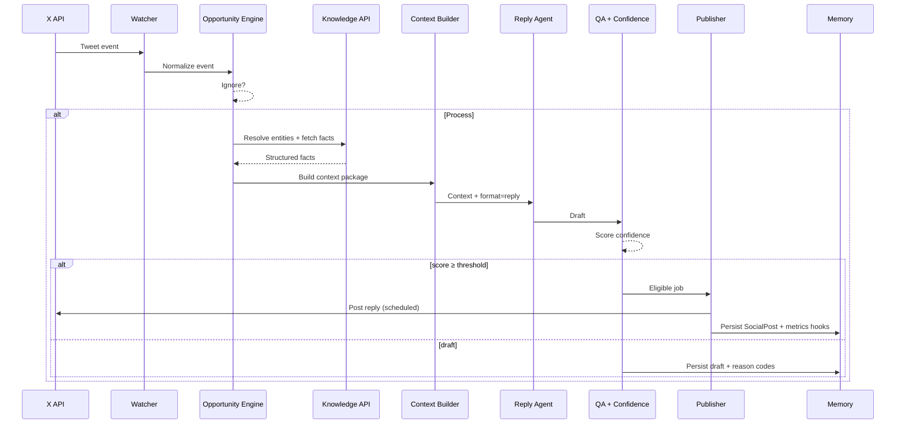
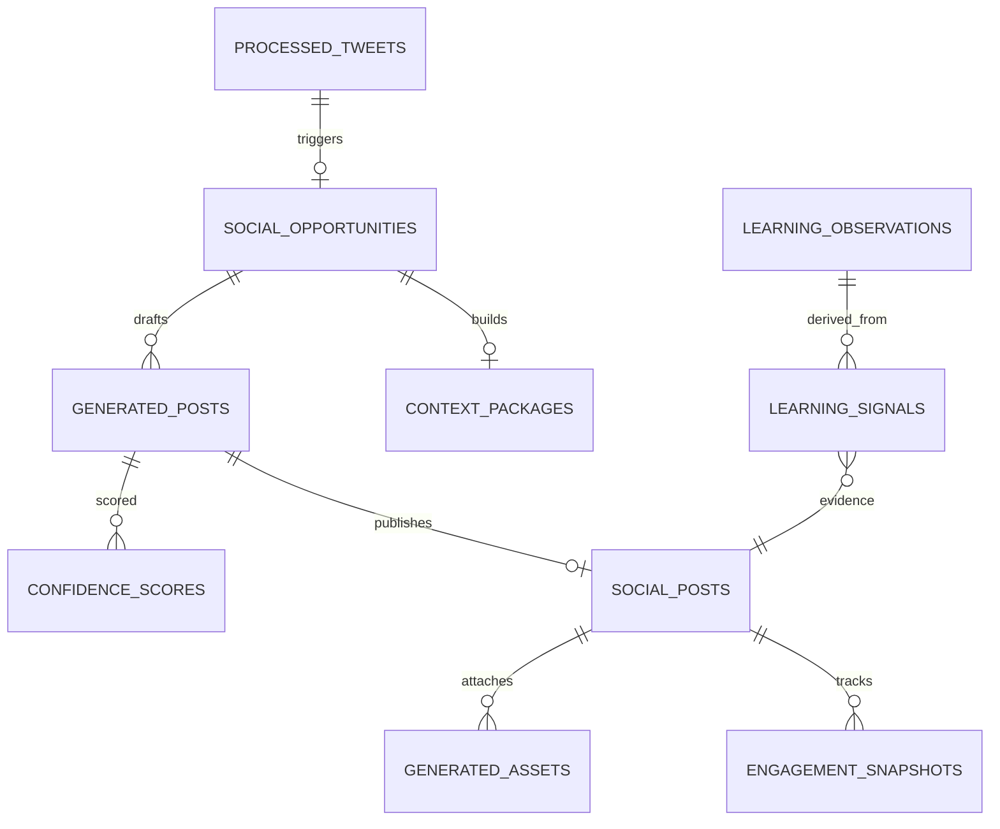

# ActorRating Social AI

**Technical Architecture RFC · v1.0**  
**Status:** Draft (living source of truth)  
**Owner:** ActorRating Engineering  
**Last updated:** 2026-08-06  

---

## Document control

| Field | Value |
| --- | --- |
| Title | ActorRating Social AI — Technical Architecture |
| Version | 1.0 |
| Classification | Internal engineering RFC |
| Scope | Distribution engine for X (Twitter); extensible to other platforms |
| Implementation state | **Greenfield** — this RFC defines target architecture; update sections as components ship |
| Related product systems | Actor / Movie / Performance graph, Radar craft scores, Rate pages, Performance editorial, Leaderboards |

### How to use this document

1. This file is the **single source of truth** for the Social AI / AI distribution engine.
2. When you ship a component, update the matching section in the **same PR** (or immediately after). Mark subsections `Implemented` / `Partial` / `Planned`.
3. Do not invent alternate architectures in chat threads or Notion pages without folding decisions back here.
4. Open design questions live in [§18 Open questions](#18-open-questions--decisions-log). Resolved decisions move into the relevant body section.

### Companion files (planned)

```
docs/social-ai/
  ARCHITECTURE.md          ← this RFC (SoT)
  prompts/                 ← versioned prompt contracts (per agent)
  runbooks/                ← ops: incident, kill-switch, cost alarms
  adr/                     ← Architecture Decision Records (short, dated)
```

---

## Table of contents

1. [Vision](#1-vision)
2. [High-level system architecture](#2-high-level-system-architecture)
3. [Core principles](#3-core-principles)
4. [AI agent specifications](#4-ai-agent-specifications)
5. [Context Builder](#5-context-builder)
6. [ActorRating Knowledge API](#6-actorrating-knowledge-api)
7. [Memory system](#7-memory-system)
8. [Learning engine](#8-learning-engine)
9. [Dynamic asset engine](#9-dynamic-asset-engine)
10. [Content strategy](#10-content-strategy)
11. [Publishing rules](#11-publishing-rules)
12. [Database schema](#12-database-schema)
13. [n8n workflow architecture](#13-n8n-workflow-architecture)
14. [Deployment roadmap](#14-deployment-roadmap)
15. [Monitoring](#15-monitoring)
16. [Confidence Score](#16-confidence-score)
17. [Operational guidelines](#17-operational-guidelines)
18. [Open questions & decisions log](#18-open-questions--decisions-log)
19. [Appendix](#19-appendix)

---

## 1. Vision

### 1.1 Mission

Build a **tasteful, data-grounded distribution engine** that puts ActorRating’s craft-first point of view into cultural conversations on X — without sounding like a bot, without fabricating facts, and without turning every mention into an ad.

ActorRating rates **acting craft**, not movie quality. Social AI must reinforce that distinction in every public word.

### 1.2 Why we are building this

| Problem today | Cost | How Social AI helps |
| --- | --- | --- |
| Great rate-page / radar content is mostly pull (SEO, word of mouth) | Growth slow outside organic search | Push craft insights into live discourse where actors and films are already trending |
| Manual social is high quality but not scalable | Founder time, inconsistent cadence | System drafts / posts within strict brand + data guardrails |
| Generic “AI marketing bots” damage trust | Brand risk | Structured Knowledge API + Confidence Score + human thresholds |
| Trends move faster than research | Missed moments | Event → opportunity → context → agents pipeline measured in minutes, not days |

### 1.3 Guiding principles (summary)

Full list in [§3](#3-core-principles). The north star is:

> **Every automated post should feel like something a sharp film-literate human at ActorRating would publish after checking the numbers.**

### 1.4 Success metrics

**North-star**

- Sustained growth in **qualified visits** to ActorRating from social (rate pages, actor/movie hubs, craft leaderboards), attributed and non-spammy.

**Product / brand**

| Metric | Target direction | Notes |
| --- | --- | --- |
| Brand-safe incident rate | → 0 | Fabrication, wrong entity, offensive reply |
| Share of posts with Confidence ≥ auto-publish threshold | Stable or ↑ | Threshold starts conservative (see §16) |
| Click-through to AR from posts that include links | ↑ | Not every post needs a link |
| Reply helpfulness (human sample audit) | ≥ 80% “adds value” | Weekly sample |
| Duplicate / near-duplicate publish rate | → 0 | Memory system |

**Engagement (secondary, never primary)**

- Impressions, reply rate, quote rate, follower growth — tracked for learning, **not** optimized blindly.

**System**

| Metric | Initial SLO |
| --- | --- |
| Event → decision latency (p95) | &lt; 5 minutes for high-priority accounts |
| Knowledge API p95 | &lt; 400 ms cached / &lt; 2 s cold |
| Auto-publish error rate | &lt; 1% of eligible posts |
| Human review queue backlog | &lt; 50 drafts older than 24h |

### 1.5 Non-goals

Social AI **must never**:

1. Impersonate ActorRating users or invent community quotes.
2. Fabricate scores, rankings, cast lists, release dates, or quotes not present in ActorRating (or a vetted citation path).
3. Post political activism, culture-war bait, harassment, or pile-ons.
4. Optimize purely for engagement / virality at the expense of brand voice.
5. Self-modify production prompts without a human-reviewed change process ([§8](#8-learning-engine)).
6. Mass-reply, spam hashtags, or follow/unfollow growth hacks.
7. Claim ActorRating is an “AI rating engine” for performances we do not support with data.
8. Auto-post below Confidence threshold without explicit human approval.
9. Leak private user data, emails, or non-public ratings.
10. Become a general-purpose movie chatbot unanchored from craft and ActorRating.

### 1.6 Product thesis

We win by being the account that **brings receipts** (Radar craft dimensions, community consensus, comparisons, leaderboards) into conversations that already care about acting — then invites discussion, not sermons.

---

## 2. High-level system architecture

### 2.1 System diagram

```text
                         X API
                           │
                           ▼
                  Event Collection Layer
                           │
                           ▼
                 Content Opportunity Engine
                           │
                 ┌─────────┴─────────┐
                 │                   │
           Ignore Tweet        Process Tweet
                                     │
                                     ▼
                      ActorRating Knowledge API
                                     │
                                     ▼
                           Context Builder
                                     │
                                     ▼
                      Multi-Agent AI Pipeline
                                     │
       ┌──────────────┬──────────────┬──────────────┐
       ▼              ▼              ▼              ▼
  Reply Agent   Quote Agent   Thread Agent   Original Post Agent
       │              │              │              │
       └──────────────┴──────────────┴──────────────┘
                              ▼
                  Quality Assurance Agent
                              ▼
                    Confidence Scorer
                              ▼
              ┌───────────────┴───────────────┐
              ▼                               ▼
     Auto-publish eligible              Draft / review queue
              ▼                               ▼
      Publishing Scheduler              (human or discard)
              ▼
              X
              ▼
    Engagement Collection Engine
              ▼
        Learning & Analytics
```

### 2.2 Component overview

| Layer | Responsibility | Primary tech (target) |
| --- | --- | --- |
| Event Collection | Ingest mentions, tracked accounts, keyword/trend streams | X API + n8n Watcher |
| Opportunity Engine | Classify → ignore / reply / quote / thread / original seed | Rules + light model |
| Knowledge API | Deterministic ActorRating facts for social | Next.js route handlers / internal API |
| Context Builder | Assemble structured context packages | Service module + cache |
| Agents | Draft copy / structure per format | LLM with versioned prompts |
| QA + Confidence | Brand, facts, uniqueness, entity match | LLM critic + deterministic checks |
| Scheduler / Publisher | Human-like cadence, limits, kill-switch | n8n + Postgres |
| Assets | Charts, cards, comps from DB | Image render pipeline |
| Memory + Learning | Performance store + human-curated observations | Postgres |

### 2.3 End-to-end sequence (reply path)



### 2.4 Trust boundary

```text
┌─────────────────────────────────────────────────────────┐
│ Untrusted: X content, trends, LLM free-text              │
└───────────────────────────┬─────────────────────────────┘
                            │ never published as fact
                            ▼
┌─────────────────────────────────────────────────────────┐
│ Trusted: ActorRating Postgres + Knowledge API outputs     │
│ Scores, cast, radar, leaderboards, editorial (published)  │
└───────────────────────────┬─────────────────────────────┘
                            │ only this may be stated as AR truth
                            ▼
┌─────────────────────────────────────────────────────────┐
│ Generated social copy (gated by QA + Confidence)         │
└─────────────────────────────────────────────────────────┘
```

---

## 3. Core principles

1. **Quality &gt; quantity** — Fewer excellent posts beat a firehose.
2. **Never sound automated** — No corporate filler, no “As an AI…”, no emoji spam, no hashtag walls.
3. **Always add value** — Insight, comparison, craft dimension, or a sharper question.
4. **Never fabricate facts** — If Knowledge API cannot support it, do not assert it.
5. **Use ActorRating data whenever possible** — Radar, community score, cohort rankings, comps.
6. **Promote discussion rather than advertise** — Soft CTAs; links earned, not forced.
7. **Every post should strengthen the brand** — Craft-first, respectful, specific.
8. **Structured knowledge over open-web search** — Agents consume Context Packages, not random browsing.
9. **Human-in-the-loop where risk is high** — Low confidence → draft, never silent auto-post.
10. **Learn from outcomes without mutating prompts in the wild** — Observations feed *inputs*, not hot-edited system prompts.
11. **Idempotent & restartable pipelines** — n8n workflows and jobs must tolerate retries.
12. **Measurable confidence** — No publish without a persisted Confidence Score breakdown.

---

## 4. AI agent specifications

Conventions for every agent:

| Field | Meaning |
| --- | --- |
| Purpose | Why it exists |
| Inputs | Typed contract |
| Outputs | Typed contract |
| Prompt | Reference to `docs/social-ai/prompts/<agent>@vN.md` (not inline sprawl long-term) |
| Temperature | Default sampling |
| Tools | Allowed tool/API calls |
| Failure modes | Expected errors |
| Retry logic | When / how many |
| Confidence contribution | Which Confidence sub-scores it influences |

Global LLM policy:

- Prefer **JSON-mode / schema outputs** for any agent whose output feeds another machine step.
- Log `prompt_version`, `model`, `input_hash`, `latency_ms`, `token_usage` on every call.
- No agent may call X publish APIs directly — only Publisher may.

---

### 4.1 Trend Scout / Opportunity Classifier

| | |
| --- | --- |
| **Purpose** | Decide what to do with an inbound event (or whether to ignore). Emit a content opportunity, not final copy. |
| **Inputs** | Normalized tweet/event; account priority; recent AR social memory summaries; optional trend metadata |
| **Outputs** | `{ decision: ignore\|reply\|quote\|thread\|original_seed\|poll, reason_codes[], brand_relevance_0_100, trending_score_0_100, entity_hints[] }` |
| **Prompt** | `prompts/opportunity-classifier@v1.md` |
| **Temperature** | 0.2 |
| **Tools** | Optional: Knowledge API entity suggest (cheap) |
| **Failure modes** | Over-triggering on noise; missing priority accounts; false entity hints |
| **Retry logic** | 1× on parse failure; else ignore + log |
| **Confidence** | Feeds `relevance` prior |

**Ignore rules (deterministic, before LLM when possible):**

- Retweets of our own content with no commentary  
- Pure spam / crypto / adult / hate  
- Already processed `tweet_id`  
- Author muted / blocklist  
- Outside language policy (v1: English primary)

---

### 4.2 Research Agent

| | |
| --- | --- |
| **Purpose** | Resolve entity hints into ActorRating IDs and decide which Knowledge endpoints to call. Does **not** invent facts. |
| **Inputs** | Entity hints; tweet text; opportunity type |
| **Outputs** | `{ actors[], movies[], performances[], unresolved[], query_plan[] }` |
| **Prompt** | `prompts/research-agent@v1.md` |
| **Temperature** | 0.0–0.1 |
| **Tools** | `GET /social/resolve`, search endpoints only |
| **Failure modes** | Wrong Leonardo (ambiguous names); movie year collisions |
| **Retry logic** | 1× with disambiguation prompt if multiple candidates above threshold |
| **Confidence** | Dominant input to `entity_match` |

If unresolved and no high-confidence entity → opportunity degrades to ignore or human draft with explanation.

---

### 4.3 Context Builder (service, not chatty LLM)

See [§5](#5-context-builder). Prefer **deterministic assembly**. Optional tiny LLM step only to choose which packages to include when budgets are tight.

---

### 4.4 Reply Writer

| | |
| --- | --- |
| **Purpose** | Write a reply that adds craft value to a specific tweet. |
| **Inputs** | Context Package; source tweet; brand voice card; learning observations (read-only); similar past replies to avoid |
| **Outputs** | `{ text, link_suggestion?, tone_tags[], claims[] }` where `claims[]` map to Knowledge fact IDs |
| **Prompt** | `prompts/reply-writer@v1.md` |
| **Temperature** | 0.7 |
| **Tools** | None (context only) |
| **Failure modes** | Generic praise; advertising tone; unsupported claims |
| **Retry logic** | 1× rewrite if QA fails on tone/claims |
| **Confidence** | `on_brand`, `factual_support`, `uniqueness`, `relevance` |

**Style constraints (v1):**

- Prefer under 240 characters when possible; hard max 280 unless thread format chosen  
- Max one link  
- No more than one rhetorical question  
- Do not lead with “Actually…” dunk energy unless opportunity tagged debate-friendly  

---

### 4.5 Quote Writer

| | |
| --- | --- |
| **Purpose** | Produce quote-tweet commentary that reframes for ActorRating’s audience. |
| **Inputs** | Same as Reply + quote-specific angle options |
| **Outputs** | `{ text, angle, claims[], asset_request? }` |
| **Prompt** | `prompts/quote-writer@v1.md` |
| **Temperature** | 0.75 |
| **Failure modes** | White room restating the tweet; dunking |
| **Retry logic** | 1× |
| **Confidence** | Same family as Reply |

---

### 4.6 Thread Writer

| | |
| --- | --- |
| **Purpose** | Multi-tweet craft narrative grounded in Context Package. |
| **Inputs** | Context Package; outline constraints (3–7 tweets); asset slots |
| **Outputs** | `{ tweets[], claims_by_tweet[], asset_slots[] }` |
| **Prompt** | `prompts/thread-writer@v1.md` |
| **Temperature** | 0.65 |
| **Failure modes** | Repetition; unsupported mid-thread claims; weak hook |
| **Retry logic** | Outline regen once, then full regen once |
| **Confidence** | Stricter factual_support required for auto-publish |

---

### 4.7 Original Post Agent

| | |
| --- | --- |
| **Purpose** | Calendar / radar-driven posts not tied to an inbound tweet (comparisons, “score of the day”, craft explainers). |
| **Inputs** | Content calendar slot OR trending AR internal signal; Context Package; asset capabilities |
| **Outputs** | `{ format, text|tweets[], asset_request?, claims[] }` |
| **Prompt** | `prompts/original-post@v1.md` |
| **Temperature** | 0.7 |
| **Failure modes** | Samey “Daily dose” cadence; thin data |
| **Retry logic** | 1× |
| **Scheduling** | Always via Publishing Scheduler (never immediate spray) |

---

### 4.8 Quality Assurance Agent

| | |
| --- | --- |
| **Purpose** | Adversarial check before Confidence finalization. |
| **Inputs** | Draft; Context Package; claims[]; source tweet; brand policy checklist |
| **Outputs** | `{ pass: boolean, violations[], rewrite_hints[], sub_scores_hint }` |
| **Prompt** | `prompts/qa-agent@v1.md` |
| **Temperature** | 0.1 |
| **Deterministic checks (must run regardless of LLM)** | Length; banned phrases; claim→fact ID existence; link allowlist; near-duplicate similarity vs memory; entity IDs present in context |
| **Failure modes** | LLM QA rubber-stamping |
| **Retry logic** | Escalate to rewrite pipeline once; then draft |

---

### 4.9 Learning Agent

| | |
| --- | --- |
| **Purpose** | Periodic batch job: read analytics → extract **observations** (not new system prompts). |
| **Inputs** | Engagement snapshots; post metadata; human audit labels |
| **Outputs** | Rows in `learning_signals` / `learning_observations` with evidence links |
| **Prompt** | `prompts/learning-agent@v1.md` |
| **Temperature** | 0.3 |
| **Cadence** | Daily (off-peak) |
| **Hard rule** | Must **not** write to prompt files or change temperatures in production automatically |

---

### 4.10 Asset Brief Agent (optional thin layer)

Translates “we should show a radar for X” into a typed `asset_request` for the Dynamic Asset Engine. No pixels — only specs.

---

## 5. Context Builder

**Status:** Planned · **Critical path for quality**

The Context Builder is the heart of the system. Generators **never browse randomly**. They receive a **Context Package**: a bounded, structured JSON document assembled from the Knowledge API.

### 5.1 Goals

- Deterministic, auditable inputs to every generation  
- Token-budget aware (truncate by priority, never by silent omission of required entities)  
- Every factual claim later mapped back to package fact IDs  

### 5.2 Pipeline (example)

```text
Input: “Leonardo joins Nolan film”

        ▼
Find actor          → ActorRating Actor (id, slug, name, aliases)
        ▼
Find movie / project → Movie (if released / catalogued) or tentative title note
        ▼
Find director       → director field / related movies
        ▼
Find collaborations → prior actor↔director / co-star performances
        ▼
Find radar scores   → dimension averages for selected performances
        ▼
Find community ratings → counts, aggregate craft score where public
        ▼
Find related AR URLs → rate pages, hubs (canonical only)
        ▼
Find recent AR social posts about entity (anti-dupe)
        ▼
Create structured Context Package
```

### 5.3 Context Package schema (v1)

```ts
type ContextPackage = {
  package_id: string
  created_at: string
  opportunity_id: string
  source?: {
    platform: "x"
    tweet_id: string
    author_handle: string
    text: string
    url: string
    lang?: string
  }
  entities: {
    actors: ActorFact[]
    movies: MovieFact[]
    performances: PerformanceFact[]
  }
  facts: Fact[]                 // canonical list with stable fact_id
  assets_available: AssetHint[]
  brand: {
    voice_card_version: string
    must_include?: string[]
    must_avoid?: string[]
  }
  memory: {
    recent_posts_about_entities: PriorPostSummary[]
    learning_observations: ObservationSummary[] // top-N, typed
  }
  budgets: {
    max_tokens_for_writer: number
    max_claims: number
  }
  unresolved: UnresolvedEntity[]
  builder_version: string
}
```

`Fact` example:

```ts
type Fact = {
  fact_id: string            // e.g. "perf:avg:tt0468569:nm0000288"
  type: "radar_dim" | "aggregate_score" | "rating_count" | "cast" | "year" | "editorial_excerpt" | "leaderboard_rank"
  text: string               // human-readable, already safe to paraphrase
  value?: number | string
  entity_refs: string[]
  source: "actorrating_db"
  as_of: string
}
```

### 5.4 Priority / truncation order

When over budget, drop in this order (last dropped first kept):

1. Learning observations (keep top 3)  
2. Prior social posts beyond last 5  
3. Secondary performances  
4. Editorial excerpts  
5. Leaderboard neighbors  
6. **Never drop** primary actor/movie identity facts or the primary performance radar if present  

### 5.5 Anti-hallucination contract

Writers may only assert facts that appear in `facts[]` **or** clearly marked subjective opinion with no numeric claim.

QA rejects any `claims[]` entry whose `fact_id` is missing.

---

## 6. ActorRating Knowledge API

**Status:** Planned (new internal surface; prefer reusing existing Prisma/domain libs)

Base path (target): `/api/internal/social/*` or `/api/social/*` with service auth.

Auth: `SOCIAL_AI_SERVICE_KEY` (or mTLS in later phase). Never expose privileged endpoints publicly without auth.

### 6.1 Endpoint catalog (v1 target)

| Method | Path | Purpose |
| --- | --- | --- |
| GET | `/social/health` | Liveness |
| GET | `/social/resolve` | Entity resolution from text / names |
| GET | `/social/context` | **Primary** — build or return Context Package |
| GET | `/social/actors/:idOrSlug` | Actor card |
| GET | `/social/movies/:idOrSlug` | Movie card |
| GET | `/social/performance` | Performance by actor+movie |
| GET | `/social/radar` | Craft dimension profile |
| GET | `/social/compare` | Two performances / actors comparison payload |
| GET | `/social/leaderboards` | Craft / genre / director board slices |
| GET | `/social/similar` | Similar performances by craft |
| GET | `/social/trending` | Internal AR trending (ratings velocity), not X trends |

Exact external REST shapes may wrap existing app routers; the contract below is what Social AI depends on.

### 6.2 `GET /social/context`

**Query**

| Param | Required | Description |
| --- | --- | --- |
| `opportunity_id` | yes | Correlation id |
| `tweet_id` | no | For memory + logging |
| `actor_ids` / `movie_ids` | no | Prefers resolved IDs |
| `q` | no | Free text hints if unresolved |
| `mode` | no | `reply` \| `quote` \| `thread` \| `original` |
| `max_facts` | no | Default 40 |

**Response:** `ContextPackage` (§5.3)

**Caching:** Redis/Postgres `asset_cache`-style key: `ctx:v1:{hash(entities+mode)}` TTL 15–60 minutes. Bypass cache on `refresh=1`.

**Rate limits:** Per service key; burst protect (e.g. 60/min).

### 6.3 `GET /social/resolve`

Input: `text` or `names[]`  
Output: ranked candidates with confidence, types (`actor`|`movie`), AR ids/slugs.

### 6.4 `GET /social/radar`

Input: `actorId` + `movieId` (or `performanceId`)  
Output: five craft dimensions (Emotional Range & Depth, Character Believability, Technical Skill, Screen Presence, Chemistry & Interaction), aggregate, rating count, URLs.

### 6.5 `GET /social/compare`

Input: two performances or two actors (with optional film scope)  
Output: aligned dimension deltas + short “facts only” bullet list for writers.

### 6.6 Caching & SLOs

| Endpoint | Cache TTL | p95 cold | p95 warm |
| --- | --- | --- | --- |
| resolve | 10m | 800ms | 50ms |
| context | 15–60m | 2s | 100ms |
| radar/compare | 30m | 500ms | 50ms |
| leaderboards | 10m | 1s | 80ms |

### 6.7 Rate limits & abuse

- Service-to-service auth required  
- Per-route quotas  
- Expensive compare/leaderboard endpoints require stronger cache  

---

## 7. Memory system

Social AI memory is **performance memory**, not a rolling chat transcript.

### 7.1 What we remember

- What we posted (and why — opportunity + context hash)  
- What we replied to (source tweet ids)  
- Which assets we generated  
- Engagement over time  
- Learning observations derived from that history  
- Failures / QA rejects (so we do not repeat)

### 7.2 What we do not remember as “truth”

- Free-form LLM speculation  
- User DMs  
- Unverified third-party gossip  

### 7.3 Logical stores

| Store | Purpose |
| --- | --- |
| `social_posts` | Canonical outbound posts |
| `social_replies` / source mapping | Inbound↔outbound edges |
| `quote_tweets` | Quote-specific metadata |
| `generated_assets` | Raster/SVG artifacts + params |
| `performance_metrics` / `engagement_snapshots` | Time series |
| `learning_signals` | Raw extracted patterns |
| `learning_observations` | Curated, prompt-safe observations |
| `processed_tweets` | Idempotency for inbound |

Detailed physical schema: [§12](#12-database-schema).

### 7.4 Uniqueness

Before publish, embed or fingerprint `text` and compare to `social_posts` in last N days (cosine / trigram). Near-dupe → Confidence penalty or hard fail.

---

## 8. Learning engine

### 8.1 Philosophy

```text
Yesterday
   ▼
Read analytics + audit labels
   ▼
Extract patterns
   ▼
Store observations (evidence-linked)
   ▼
Future prompts receive observations as read-only context
```

**No self-modifying production prompts.**  
Prompt changes = PR + version bump + evaluation notes.

### 8.2 Observation types (examples)

| Type | Example |
| --- | --- |
| `format_affinity` | “Radar image quotes on premiere-week film accounts outperform text-only” |
| `tone` | “Short craft deltas get more bookmarks than long praise” |
| `entity` | “Ambiguous name ‘Michael’ high misresolve risk — require year/film” |
| `timing` | “Replies &gt;45 min late underperform on breaking casting news” |
| `avoid` | “Posts that say ‘underrated’ without data underperform + QA flags” |

### 8.3 Pipeline

1. **Collect** engagement snapshots (hourly/daily)  
2. **Join** to posts + opportunity features  
3. **Learning Agent** proposes observations with confidence + evidence post ids  
4. **Human accept/reject** (admin UI or labeled review) — required for `active=true`  
5. Context Builder attaches top active observations relevant to entities/format  

### 8.4 Explicit non-goals for v1–v3

- Auto A/B rewriting system prompts nightly  
- Reinforcement learning that updates weights without review  
- Scraping competitors’ replies as training without legal review  

---

## 9. Dynamic asset engine

Generate brand-consistent visuals from **database truth**, not from LLM-drawn fake charts.

### 9.1 Asset types

| Type | Data source | Typical use |
| --- | --- | --- |
| Radar chart | Performance dimensions | Quote / reply / original |
| Comparison graphic | `/social/compare` | Quote / thread / original |
| Leaderboard slice | Leaderboards API | Original / thread |
| Tier list | Curated query + scores | Original (careful) |
| Performance card | Actor + movie + score | Reply / quote |

### 9.2 Pipeline

```text
asset_request (typed)
   ▼
Validate entities + fetch knowledge payload
   ▼
Render template (Satori / Playwright / dedicated renderer)
   ▼
Store generated_assets (png/webp + params JSON)
   ▼
Publisher attaches media
```

### 9.3 Rules

- Template versions are code; content params are data  
- Watermark / logo per brand kit  
- Never render dimensions that are null as “0” without labeling missing  
- Cache by `(type, template_version, params_hash)`  

---

## 10. Content strategy

### 10.1 Decision matrix

| Opportunity signals | Prefer | Avoid |
| --- | --- | --- |
| High brand relevance + clear AR entities + question/opinion | **Reply** | Ignore |
| Viral take we can reframe with data | **Quote** (+ asset if delta is visual) | Reply buried in 2k comments |
| Rich multi-fact story (career craft arc) | **Thread** | Single reply dump |
| Evergreen AR insight / calendar | **Original** | Reactive dunk |
| Binary audience fork | **Poll** (later) | Fake engagement polls |
| Low relevance / unresolved entity / risk | **Ignore** | “Just say something” |

### 10.2 Scoring model (Opportunity Engine)

```text
expected_value ≈
    w1 * brand_relevance
  + w2 * entity_confidence
  + w3 * trending_score
  + w4 * account_priority
  + w5 * novelty_vs_memory
  − w6 * risk_flags
```

Publish capacity is scarce; only top EV opportunities enter generation.

### 10.3 Format × Confidence thresholds

| Format | Auto-publish Confidence (initial) |
| --- | --- |
| Reply | ≥ 85 |
| Quote | ≥ 88 |
| Original single | ≥ 90 |
| Thread | ≥ 92 |
| Poll | Human-only (v1) |

Thresholds are config, not hard-coded magic — change via ADR + deploy.

---

## 11. Publishing rules

Human-like, brand-safe, platform-safe.

### 11.1 Cadence & limits (initial defaults)

| Rule | Default |
| --- | --- |
| Max auto posts / day | 8 |
| Max auto replies / day | 12 |
| Max to same author / 24h | 1 |
| Max about same movie / 6h | 2 |
| Min delay after event | 3–25 min jitter |
| Quiet hours | Configurable timezone window |
| Burst protection | ≤ 2 posts / 15 min |

### 11.2 Duplicate detection

- Exact tweet_id processed → skip  
- Near-duplicate text vs last 30 days → block or rewrite  
- Same `context_hash` + format within 7 days → block  

### 11.3 Priority accounts

Maintain allowlist tiers (e.g. major film reporters, cast/crew, reputable critics). Higher tier → higher EV weight + slightly lower delay floor.

### 11.4 Kill switches

| Switch | Effect |
| --- | --- |
| `SOCIAL_AI_PUBLISH_ENABLED=false` | Generate drafts only |
| `SOCIAL_AI_REPLIES_ENABLED=false` | Pause replies |
| Panic mute in admin | Cancel queued jobs |

### 11.5 Link policy

- Only `actorrating.com` (and approved short domains)  
- UTM convention: `utm_source=x&utm_medium=social_ai&utm_campaign={format}`  

---

## 12. Database schema

**Status:** Planned · Prisma models to be added in a dedicated migration when v1 implementation starts.

### 12.1 ER overview



### 12.2 Tables (logical)

#### `processed_tweets`

| Column | Type | Notes |
| --- | --- | --- |
| tweet_id | text PK | Idempotency |
| author_id / handle | text | |
| text | text | |
| received_at | timestamptz | |
| decision | enum | ignore/process… |
| reason_codes | text[] | |
| raw | jsonb | |

**Indexes:** `(author_id, received_at desc)`  
**Retention:** raw jsonb 30–90 days; headers longer  

#### `social_opportunities`

| Column | Type |
| --- | --- |
| id | uuid PK |
| tweet_id | text null |
| format | enum |
| scores | jsonb |
| status | enum |
| created_at | timestamptz |

#### `context_packages`

| Column | Type |
| --- | --- |
| id | uuid PK |
| opportunity_id | uuid FK |
| package | jsonb |
| builder_version | text |
| input_hash | text |
| created_at | timestamptz |

#### `generated_posts` (drafts + candidates)

| Column | Type |
| --- | --- |
| id | uuid PK |
| opportunity_id | uuid |
| format | enum |
| text / tweets | text / jsonb |
| claims | jsonb |
| prompt_version | text |
| model | text |
| status | draft/approved/rejected/scheduled/published/failed |
| confidence_total | int |
| created_at | timestamptz |

#### `social_posts` (published truth)

| Column | Type |
| --- | --- |
| id | uuid PK |
| generated_post_id | uuid |
| platform | text |
| platform_post_id | text unique |
| posted_at | timestamptz |
| text | text |
| permalink | text |
| entity_ids | text[] |

#### `reply_history`

Maps `source_tweet_id` → `social_post_id` for replies/quotes.

#### `generated_assets` / `asset_cache`

Store binary URL (R2/S3), template version, params hash, width/height.

#### `engagement_snapshots`

| Column | Type |
| --- | --- |
| social_post_id | uuid |
| captured_at | timestamptz |
| likes, replies, reposts, quotes, bookmarks, impressions | ints |
| link_clicks | int null |

#### `learning_signals` / `learning_observations`

Signals = raw proposals; observations = human-approved, prompt-safe.

#### `trend_history`

Optional: X trend snapshots we chose to track (careful with ToS / storage).

#### `confidence_scores`

| Column | Type |
| --- | --- |
| generated_post_id | uuid PK/FK |
| entity_match | int |
| on_brand | int |
| uniqueness | int |
| factual_support | int |
| relevance | int |
| total | int |
| threshold | int |
| eligible_auto | boolean |
| breakdown | jsonb |

### 12.3 Indexing & retention (policy)

- Hot engagement data: 180 days full fidelity; rollups thereafter  
- Drafts rejected: 60 days  
- Published posts: indefinite  
- Context packages: 90 days (can regenerate from hashes if needed)  

---

## 13. n8n workflow architecture

Prefer **independent, restartable workflows** over one mega-graph.

```text
Watcher
  ▼
Opportunity / Router
  ▼
Context Builder job
  ▼
Reply | Quote | Thread | Original Generator
  ▼
QA + Confidence
  ▼
Publisher
  ▼
Analytics Collector
  ▼
Learning Engine (scheduled)

(parallel)
Asset Generator (on demand from asset_request queue)
```

### 13.1 Workflow catalog

| Workflow | Trigger | Idempotency key |
| --- | --- | --- |
| `wf_watcher` | X webhook / poll | `tweet_id` |
| `wf_opportunity` | new processed tweet | `tweet_id` |
| `wf_context` | opportunity process | `opportunity_id` |
| `wf_gen_reply` | opportunity format=reply | `opportunity_id` |
| `wf_gen_quote` | … | … |
| `wf_gen_thread` | … | … |
| `wf_gen_original` | cron / calendar | `calendar_slot_id` |
| `wf_qa_confidence` | generated_post created | `generated_post_id` |
| `wf_publish` | eligible + scheduled_at | `generated_post_id` |
| `wf_analytics` | cron hourly | `social_post_id+hour` |
| `wf_learning` | cron daily | `date` |
| `wf_assets` | asset_request queue | `params_hash` |

### 13.2 Failure handling

- All HTTP steps: retry with backoff (max 3) on 429/5xx  
- Poison messages → `status=failed` + alert; do not infinite loop  
- Publisher must re-check kill switch + Confidence + daily caps immediately before post  

### 13.3 Why not one workflow

Independent workflows scale, allow partial deploys (e.g. freeze Publisher while iterating generators), and match on-call mental models.

---

## 14. Deployment roadmap

| Phase | Name | Ships | Exit criteria |
| --- | --- | --- | --- |
| **v1** | Auto replies (assisted) | Watcher → context (manual/light) → reply drafts → human approve → publish | 50 approved replies, 0 brand incidents |
| **v2** | Context Builder | Full Knowledge API context packages; claim↔fact enforcement | ≥90% drafts with factual_support ≥80 |
| **v3** | Quote tweets | Quote writer + duplicate memory | Quotes live with threshold 88 |
| **v4** | Original posts | Calendar + scheduler jitter | 5 originals/week sustainable quality |
| **v5** | Dynamic radar / assets | Radar + comparison renders attached | ≥30% quotes with assets when eligible |
| **v6** | Learning engine | Observations + admin accept loop | Active observations influencing ≥20% posts |
| **v7** | Multi-platform | Abstractions for IG/LinkedIn/etc. | Platform interface + 1 second channel |

### 14.1 Implementation vertical slice (first engineering epic)

1. Schema migration for memory tables  
2. `GET /social/resolve` + `GET /social/radar` + `GET /social/context` MVP  
3. Reply draft generator + QA + Confidence persistence  
4. Admin review queue (approve/reject)  
5. Publisher with kill switch  
6. Watcher for mention stream only  

Do not start with fully autonomous public replies on day one.

---

## 15. Monitoring

### 15.1 Health dashboard (metrics)

| Area | Metrics |
| --- | --- |
| Pipeline | Queue depth per workflow; age of oldest job; throughput |
| Quality | Auto vs draft rates; QA fail reasons; Confidence distribution |
| Cost | LLM tokens $ / day; X API usage; render minutes |
| Publish | Success/fail; delay vs target jitter; cap hits |
| Engagement | CTR, replies, bookmarks by format |
| Learning | Observations proposed vs accepted; stale observations |

### 15.2 Alerts

| Condition | Severity |
| --- | --- |
| Publish enabled + error rate &gt; 5% / 15m | P1 |
| Confidence scorer down | P1 (force draft-only) |
| Knowledge API p95 &gt; 5s | P2 |
| Daily spend &gt; budget | P2 |
| Zero posts for 24h while enabled | P3 |

### 15.3 Audit

Weekly human review sample: 20 auto posts + 20 drafts. Log labels into learning.

---

## 16. Confidence Score

Every generated candidate receives a **Confidence Score (0–100)** before it can auto-publish.

### 16.1 Sub-scores

| Signal | Weight (initial) | How measured |
| --- | --- | --- |
| **Entity match** | 0.25 | Resolver confidence + Research Agent agreement + deterministic ID presence |
| **On-brand** | 0.20 | QA agent + banned-phrase / tone heuristics |
| **Uniqueness** | 0.15 | Distance vs recent `social_posts` |
| **Factual support** | 0.25 | % of claims with valid `fact_id`; penalty for unsourced numbers |
| **Relevance** | 0.15 | Opportunity relevance × semantic fit to source tweet |

```text
total = round(100 * Σ weight_i * (sub_i / 100))
```

Weights are config; changes require ADR.

### 16.2 Eligibility

```text
IF total >= format_threshold
AND entity_match >= 80
AND factual_support >= 80
AND no hard QA violations
AND publish kill-switch off
AND under daily caps
THEN eligible_auto = true
ELSE draft (persist reason codes)
```

### 16.3 Persistence

Always store full breakdown on `confidence_scores` for learning and dispute analysis.

### 16.4 Calibration

Month 1: bias toward **false negatives** (too many drafts) over false positives (bad autos). Re-calibrate using audit labels.

---

## 17. Operational guidelines

1. **Default to draft** when uncertain.  
2. **One kill switch drill per quarter.**  
3. **Prompt changes** go through `prompts/*@vN` + eval notes; never hot-edit only in n8n UI without committing versions.  
4. **Incident:** disable publish → snapshot failing `generated_post_id`s → patch → staged re-enable.  
5. **Cost control:** max tokens per agent; prefer smaller models for classifier/QA; larger for writers.  
6. **Legal / ToS:** comply with X automation rules; no scrape-bypass; respect rate limits.  
7. **Keep this RFC current** — stale architecture docs are worse than none.

---

## 18. Open questions & decisions log

### 18.1 Open questions

| ID | Question | Options | Needed by |
| --- | --- | --- | --- |
| Q1 | Human review UI: in `/admin` vs external | Admin panel / Notion / Linear | v1 |
| Q2 | Embedding store for uniqueness | pgvector vs external | v2 |
| Q3 | X access tier (API product) | Free/Basic/Pro | v1 |
| Q4 | Official account handles + who holds keys | — | v1 |
| Q5 | Languages beyond English | EN-only / EN+TR / … | v3 |
| Q6 | Whether published Performance Editorial may be paraphrased into posts | yes/restricted | v2 |

### 18.2 Decisions

| Date | Decision | Rationale |
| --- | --- | --- |
| 2026-08-06 | Adopt this RFC as SoT for Social AI | Align distribution build |
| 2026-08-06 | Learning via observations, not auto prompt mutation | Controllability / safety |
| 2026-08-06 | Confidence Score gate on all auto publishes | Quality &gt; quantity |
| 2026-08-06 | n8n as independent workflows | Restartability |

---

## 19. Appendix

### 19.1 Brand voice card (seed — expand in prompts/)

- Craft-first, specific, adult, dry-warm — never snark-for-clout  
- Prefer concrete dimension language over “amazing performance”  
- Distinguish acting craft vs film quality  
- Invite curiosity; do not dunk on actors as people  

### 19.2 Claim → fact example

```json
{
  "text": "Bale’s Dark Knight run still spikes on Presence + Believability in our craft split.",
  "claims": [
    { "span": "Presence + Believability", "fact_id": "radar:dim:tt0468569:nm0000288:top2" }
  ]
}
```

### 19.3 Glossary

| Term | Meaning |
| --- | --- |
| Context Package | Structured knowledge bundle for writers |
| Opportunity | Decision to potentially create content from an event |
| Observation | Human-approved learning unit injected into future context |
| Confidence | 0–100 publish eligibility score with breakdown |
| Knowledge API | Trusted ActorRating read API for social |

### 19.4 Document changelog

| Version | Date | Notes |
| --- | --- | --- |
| 1.0 | 2026-08-06 | Initial RFC — greenfield Social AI blueprint |

---

*End of RFC. Update in-repo; do not fork into conflicting docs.*
